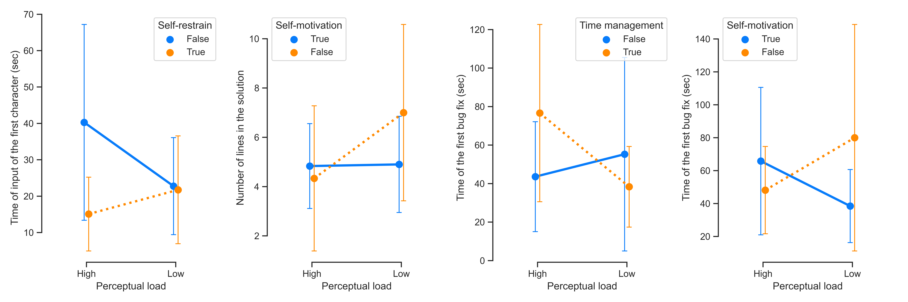

# The Effect of Perceptual Load on Performance within IDE in People with ADHD Symptoms

This repository contains data analysis for the experiment we conducted for the research on how the
perceptual load may affect programming performance in people with symptoms of ADHD. Developers filled in the Barkley's Scale, which indicates the presence and
severity levels of ADHD symptoms. After that, participants solved
mentally active programming tasks (coding) and monotonous
ones (debugging) in the PyCharm IDE. Each task were present in
high perceptual load modes (visually noisy) and low perceptual
load modes (visually clear).

The data was collected with the plugin that tracks efficiency metrics,
i.e. time, speed, and activity.

We found that the perceptual
load does affect programmers’ efficiency. Our findings
support the idea of behavioral assessment of users for providing
accommodation for the workforce with special needs. 

For more details please refer to the paper: *The Effect of Perceptual Load on Performance within IDE in People with ADHD Symptoms*

## Reproduction steps:
### Step 0: Install requirements
All requirements are listed in [pyproject.toml](pyproject.toml). Use poetry to create environment.

`poetry install`

### Step 1: Preprocess the data
The raw data collected by plugin 
located at [sources](sources) directory.

Go to [processing.ipynb](processing.ipynb) and run the code.
You can place raw data in different location,
just make sure to edit data path in the first chunk of [processing.ipynb](processing.ipynb).
```python
USER_PATH = 'sources'
```
The code should construct dataset for the analysis and save it to [data](data) directory.

### Step 2: Data analysis

Data analysis is done in [post_processing.ipynb](post_processing.ipynb).
You can run the notebook cell by cell from the beginning 
or use 'run all' button in the IDE to recreate the complete analysis.

The main results of the paper support the idea that level of perceptual load does 
affect people with and without ADHD related symptoms differently.



## Credits 
This project was made in 
[Machine Learning for Software Engineering Research Group in JetBrains Research](https://research.jetbrains.org/groups/ml_methods/). 

Supervisor and contributor of this project is [Sergey Titov](https://github.com/TitovSergey)

Authors: [Vseslav Kasatskii](https://github.com/samorojy), 
[Agnia Serheyuk](https://github.com/hugnia), 
[Anastasiia Serova](https://github.com/Nasty12oz), 
[Sergey Titov](https://github.com/TitovSergey)
